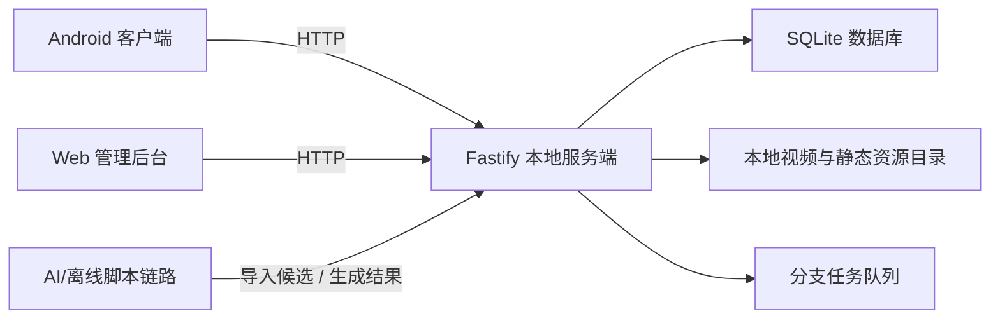
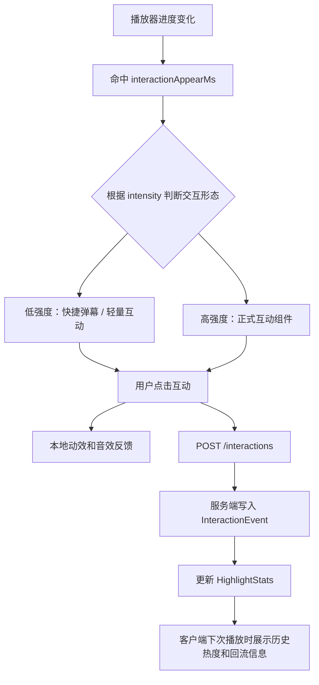
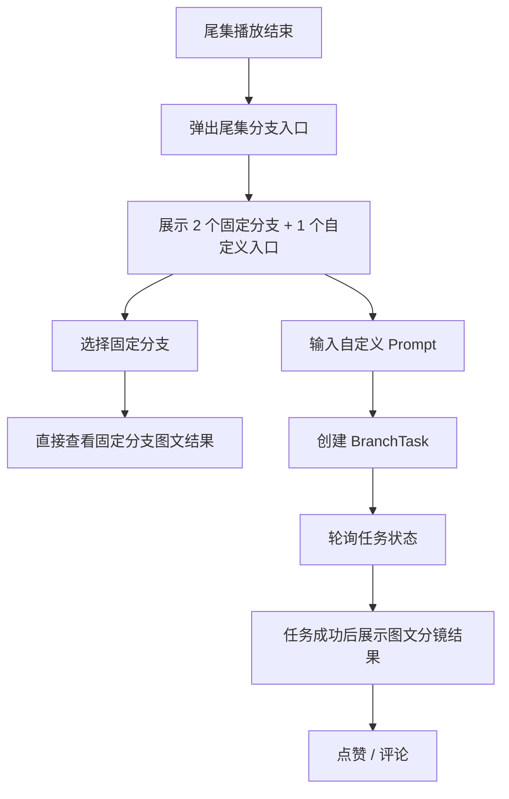

# Drama Pulse：基于短剧剧情高光的即时互动播放器项目交付文档

## 1. 项目概述

Drama Pulse 是一个面向短剧场景的互动播放器项目，目标是在不打断观看的前提下，增强用户在剧情高光时刻的即时表达能力，并在尾集结束后继续延长用户参与感。

本项目最终交付形态包括：

- Android 客户端
- 本地 Node.js 服务端
- 本地 Web 管理后台
- AI 辅助的高光识别与尾集分支生成链路

项目的一句话总结是：

> 用户先在 Android 端看剧，在剧情高光点进行即时互动，在尾集结束后进入固定或自定义剧情分支，从而把“看剧”延伸为“参与剧情”。

### 1.1 项目成果摘要

| 维度 | 当前交付结果 |
| --- | --- |
| 客户端形态 | Android 原生客户端 |
| 服务形态 | 本地 Node.js + Fastify 服务端 |
| 数据存储 | SQLite + 本地静态资源目录 |
| 互动能力 | 低强度快捷弹幕、正式高光互动组件、历史热度回流 |
| 分支能力 | 2 个固定分支 + 1 个自定义分支任务链路 |
| 后台能力 | 高光复核、互动查看、分支任务查看与重试、资源配置 |
| AI 参与 | 高光候选识别、剧情上下文整理、尾集分支剧情与分镜生成 |
| 部署方式 | 个人 PC 本地部署，局域网访问 |

## 2. 需求理解与 MVP 闭环

根据课题要求，本项目至少需要覆盖：

- 短剧列表与基础播放能力
- 剧情高光点打标和下发
- 客户端高光点互动
- 剧情分支或拓展能力
- 本地或公网部署能力

本项目选择同时完成两条用户主链路：

- 高光剧情互动
- 剧情分支或拓展

并采用比赛允许的本地部署方式：

- 个人 PC 本地服务部署 + 局域网访问

### 2.1 MVP 闭环

当前版本已经形成完整闭环：

1. 用户在 Android 客户端浏览短剧列表并进入剧集播放
2. 客户端从服务端拉取当前剧集的 confirmed 高光点
3. 播放命中 interactionAppearMs 时，根据高光强度展示对应互动形态
   - 低强度高光：快捷弹幕 / 轻量互动
   - 高强度高光：正式互动组件
4. 用户点击后，客户端触发视觉反馈并上报互动事件
5. 服务端聚合互动数据，生成高光热度和历史回流结果
6. 客户端在后续播放中展示历史热度和群体反馈
7. 尾集播放结束后，客户端弹出分支入口
8. 用户可选择 2 个固定分支或创建 1 个自定义分支
9. 自定义分支在服务端异步生成文本剧情、图文分镜和分镜图片结果
10. 客户端展示最终图文分镜结果，并支持点赞和评论

### 2.2 当前交付范围

已完成范围：

- 短剧列表页
- 剧集播放页
- 选集、暂停/播放、进度条、继续观看
- 高光标签下发
- 低强度快捷弹幕与轻量高光互动
- 高强度高光互动组件触发与上报
- 历史互动热度与回流展示
- 尾集固定分支展示
- 尾集自定义分支任务创建、轮询与结果展示
- 分支结果点赞、评论
- 本地服务端与 SQLite 存储
- 本地 Web 管理后台
- 高光 AI 候选识别与人工确认链路
- 尾集分支图文分镜生成链路

第一版明确不纳入的内容：

- 公网部署
- 登录体系与账号系统
- 实时多人同屏互动
- 播放过程中途分叉播放
- 实时视频生成
- 端上实时视频理解

## 3. 系统整体架构

### 3.1 各层职责

**Android 客户端**

- 承载短剧列表、播放页、选集、继续观看
- 承载低强度快捷弹幕、正式高光互动组件、历史热度和弹幕回流
- 承载尾集固定分支与自定义分支结果展示
- 承载分支结果点赞与评论

**本地服务端**

- 提供内容、剧集、高光、互动、分支、进度相关接口
- 负责高光互动事件聚合
- 负责固定分支读取和自定义分支任务执行
- 负责本地静态资源 path -> url 映射
- 负责为管理后台提供查询与操作接口

**本地 Web 管理后台**

- 查看和确认高光候选
- 管理高光标签状态与时间窗口
- 查看互动统计
- 查看和重试分支任务
- 管理资源配置和演示数据

**AI 与离线处理链路**

- 生成高光候选
- 生成剧情上下文包
- 生成尾集固定分支候选
- 生成自定义分支的剧情扩写、分镜与图文结果

### 3.2 运行方式

当前项目采用本地局域网部署方式：

- 服务端默认监听 `0.0.0.0:8787`
- Android 真机通过局域网 IP 访问服务端
- 管理后台在开发机本地访问同一服务端
- 视频、分镜图和静态资源都由服务端统一转换为可访问 URL

这种方式满足比赛对本地部署的要求，同时联调和演示更稳定。

## 4. 模块拆解

| 模块 | 目标 | 主要输出 |
| --- | --- | --- |
| 内容与资源模块 | 管理短剧、剧集、封面、视频和分支产物 | 可读取的本地资源目录 |
| Android 客户端模块 | 承载播放、高光互动、分支体验 | 用户播放行为、互动事件、分支任务请求 |
| 服务端业务模块 | 承接内容、高光、互动、分支和后台接口 | JSON API、静态资源 URL、任务执行状态 |
| 高光识别与管理模块 | 形成候选 -> 人工确认 -> 客户端消费链路 | confirmed 高光标签 |
| 尾集分支生成模块 | 形成固定分支 + 自定义分支任务链路 | 文本剧情、图文分镜、分镜图片、manifest |
| 数据与存储模块 | 冻结数据模型和状态口径 | SQLite schema、Prisma 模型、统一字段定义 |

### 4.1 Android 客户端模块

核心页面：

- DramaListScreen
- PlayerScreen
- BranchResultScreen

核心能力：

- 列表、播放、选集、进度恢复
- 播放器时间轴监听
- 低强度快捷弹幕与轻量互动叠层
- 高强度高光互动叠层
- 尾集入口弹出
- 固定分支与自定义分支图文结果展示
- 分支点赞与评论

### 4.2 服务端业务模块

服务端按业务领域划分为：

- content
- highlight
- interaction
- branch
- progress
- user
- assets
- admin

当前核心接口包括：

- `GET /dramas`
- `GET /dramas/:dramaId/episodes`
- `GET /episodes/:episodeId`
- `GET /episodes/:episodeId/highlights`
- `GET /highlights/:highlightId/stats`
- `POST /interactions`
- `GET /episodes/:episodeId/branch-options`
- `POST /branch-tasks`
- `GET /branch-tasks/:taskId`
- `GET /users/:userId/branch-tasks`
- `POST /branch-tasks/:taskId/likes`
- `POST /branch-tasks/:taskId/comments`
- `GET /admin/highlights`
- `POST /admin/highlights/:highlightId/confirm`
- `GET /admin/branch-tasks`
- `POST /admin/branch-tasks/:taskId/retry`

### 4.3 高光识别与管理模块

本模块的核心原则是：

> AI 先提候选，人工做冻结，客户端只消费 confirmed 标签

链路结构：

- 视频/字幕整理
- transcript 结构化
- AI 第一阶段高召回候选识别
- AI 第二阶段复核与时间修正
- 候选高光入库
- 管理后台抽检和确认
- 客户端只拉取 confirmed

### 4.4 尾集分支生成模块

尾集分支分为两条链路：

- 固定分支
  - 离线预生成
  - 当前展示为图文分镜结果
- 自定义分支
  - 用户输入 Prompt 后创建 BranchTask
  - 服务端异步生成图文结果

自定义分支的内部阶段状态包括：

- queued
- context_prepared
- prompt_interpreted
- story_generated
- assets_prepared
- storyboard_generated
- storyboard_images_generated
- manifest_generated
- completed

## 5. 核心技术选型

### 5.1 客户端

- Kotlin
- Jetpack Compose
- Media3 / ExoPlayer
- ViewModel + StateFlow
- Retrofit + OkHttp
- Coil

选择原因：

- Android 真机联调和本地视频调试成本最低
- Compose 适合高光叠层、分支结果卡片和状态驱动 UI
- ExoPlayer 便于监听时间轴和尾集结束事件

### 5.2 服务端

- Node.js 20
- TypeScript
- Fastify
- Prisma
- SQLite
- Zod

选择原因：

- 本项目是本地部署、I/O 密集、单人可控场景
- SQLite 零运维，适合比赛演示
- TypeScript 能稳定约束前后端、后台和 AI 输出结构

### 5.3 管理后台

- React
- TypeScript
- Vite
- React Router
- TanStack Query
- Tailwind CSS

选择原因：

- 后台以查询、复核、表单和任务管理为主
- 启动快，联调成本低
- 状态管理简单稳定

### 5.4 AI 链路

- 高光候选识别与复核：DeepSeek 结构化识别链路
- 尾集分支文本与图文内容生成：Doubao / 已接入模型链路

设计原则：

- 主链路轻，AI 链路异步
- 播放体验不依赖实时推理
- AI 输出必须进入结构化校验和人工复核环节

## 6. 高光互动闭环设计

### 6.1 高光数据结构

高光标签的核心时间字段拆分为三层：

- `startTimeMs / endTimeMs`：高光内容本体区间
- `interactionAppearMs`：互动组件真正出现的时间点
- `interactionStartMs / interactionEndMs`：用户可点击和重复触发的交互窗口

同时，高光结构中保留了 `type / intensity / templateId / interactionOptionsJson / visualEffectType` 等字段，用于决定客户端最终采用哪一种互动形态。

### 6.2 高光交互分层

为了避免所有高光都以同样重量级的组件打断视频画面，本项目将高光互动拆成两层：

- 低强度高光
  - 采用快捷弹幕、轻量云朵弹幕或短选项态
  - 强调低遮挡、快速响应和高频表达
- 高强度高光
  - 采用正式互动组件
  - 配合更强的视觉资源、按钮样式和短时动效

### 6.3 客户端高光触发链路

### 6.4 设计亮点

- 客户端不做高光判断，只做时间轴消费
- 低强度快捷弹幕与高强度正式组件共用一套数据链路，但视觉表达分层
- 低强度形态保证互动频率，高强度形态保证名场面的爆点表现
- 高光互动和历史回流构成闭环，不是一次性按钮

## 7. 尾集分支闭环设计

### 7.1 用户侧流程

### 7.2 固定分支

固定分支的定位是：

- 在尾集结束后立即给用户两个可选方向
- 不依赖实时生成
- 结果介质为预生成图文分镜结果

当前固定分支结果已经统一为：

- `resultHook`
- `resultStory`
- `storyboardManifestJson`
- `storyboardCards`
- 分镜图片资源

### 7.3 自定义分支结果结构

自定义分支任务最终不只输出一段文本，而是输出一套可展示结果：

- `resultTitle`
- `resultHook`
- `resultStory`
- `storyboardJson`
- `shotPromptJson`
- `storyboardImagesJson`
- `storyboardManifestJson`
- `narrationPayloadJson`
- `referenceAssetsJson`

### 7.4 当前链路的工程价值

- 固定分支与自定义分支共享了结果结构和消费方式
- 任务阶段化后，后台可以知道失败卡在哪一步
- 图文结果优先于视频生成，保证了第一版可交付和可演示

## 8. 工作项拆分与排期

本项目为单人完成，因此采用单人串行推进方式：

- 先完成播放主链路
- 再完成高光互动闭环
- 最后完成尾集分支与 AI 增强

阶段排期如下：

| 阶段 | 时间 | 主要工作项 | 主要产出 |
| --- | --- | --- | --- |
| 阶段 1 | 5/22 - 5/24 | 项目初始化、目录结构、技术方案冻结 | Android / Server / Admin 三端工程骨架 |
| 阶段 2 | 5/25 - 5/28 | 数据模型、数据库、内容接口、播放主链路 | 可播放短剧列表与剧集 |
| 阶段 3 | 5/29 - 6/01 | 高光标签结构、客户端高光触发、互动上报 | 高光互动 MVP |
| 阶段 4 | 6/02 - 6/04 | 高光复核后台、热度聚合、历史回流 | 高光闭环稳定版 |
| 阶段 5 | 6/05 - 6/08 | 固定分支、自定义分支任务、图文结果页 | 尾集分支闭环 |
| 阶段 6 | 6/09 - 6/10 | 联调、测试、提示词收口、交付文档与录屏准备 | 最终交付版 |

关键里程碑：

1. 播放主链路跑通
2. 高光互动闭环跑通
3. 尾集分支闭环跑通
4. 本地部署与演示材料收口

## 9. AI 参与说明

本项目对 AI 的使用不是“直接替代业务逻辑”，而是围绕结构化、可复核、可回滚的原则展开。

| 环节 | AI 参与方式 | 人工参与方式 |
| --- | --- | --- |
| 高光候选识别 | 从 transcript 中识别候选高光 | 后台人工确认与时间修正 |
| 高光复核 | 第二阶段复核候选时间窗口和文案 | 人工抽检和冻结 |
| 剧情上下文整理 | 生成尾集分支所需上下文包 | 人工审阅关键字段 |
| 固定分支候选生成 | 生成多条固定分支候选方向 | 人工筛选和统一风格 |
| 自定义分支剧情扩写 | 把用户 Prompt 扩展为结构化故事 | 人工调提示词与约束 |
| 分镜与提示词生成 | 生成分镜卡文案、图像提示词和参考约束 | 人工调优提示词口径 |

这样做的好处是：

- 保证演示稳定性
- 保证结果可复查、可回滚
- 避免将实时模型输出直接挂到播放器关键路径

## 10. 测试与稳定性说明

服务端当前已形成以 Vitest 为核心的测试体系，已覆盖：

- content 接口测试
- highlight 接口测试
- interaction 接口测试
- branch 接口测试
- admin 接口测试
- taskQueue、storyboard、imageClient 等模块测试

Android 端当前已覆盖：

- ViewModel 状态流测试
- Mapper 与数据转换测试
- Repository 行为测试
- Player 相关交互测试
- Branch 相关结果流转测试

当前关键稳定性策略包括：

- 客户端不依赖实时 AI 判断
- 服务端统一做资源路径映射
- 分支任务异步执行
- 高光只消费 confirmed 状态标签
- 固定分支离线预生成

## 11. 项目亮点与创新点

### 11.1 即时互动不是评论替代，而是观看内的轻表达机制

本项目把表达动作嵌入剧情高光瞬间，使互动成为观看体验的一部分。

并且互动能力是分层的：

- 低强度高光采用快捷弹幕和轻量表达
- 高强度高光采用正式组件和更强反馈

这让互动系统不是“只有一种按钮”，而是一套随剧情强弱变化的表达系统。

### 11.2 高光互动与历史回流形成了完整闭环

用户当前点击不仅触发即时反馈，还会沉淀为后续观看中的热度和回流信息，形成群体共看感。

### 11.3 尾集分支从文本结果升级为图文分镜结果

相比仅返回一段续写文本，本项目把尾集分支结果升级为：

- 文本剧情
- 分镜结构
- 分镜图
- 图文 manifest

这样更适合展示，也更有“继续参与剧情”的产品感。

### 11.4 AI 采用可控的结构化接入方式

本项目通过：

- 高光候选 + 人工冻结
- 分支异步生成 + 结构化校验

把 AI 约束在可验证、可调优、可答辩的范围内。

## 12. 交付物清单

- GitHub 仓库：[LiuAHao/drama-pulse](https://github.com/LiuAHao/drama-pulse)
- Android APK：待补充
- 项目展示录屏：待补充
- 关键页面截图：待补充
- 本交付主文档
- 技术方案与模块说明附录
- 本地启动说明

## 13. 附录文档链接

- [技术选型与落地说明](/Users/a0000/Desktop/项目文件/drama-pulse/docs/技术选型与落地说明.md)
- [Android 端技术实现方案](/Users/a0000/Desktop/项目文件/drama-pulse/docs/Android端技术实现方案.md)
- [本地服务端技术实现方案](/Users/a0000/Desktop/项目文件/drama-pulse/docs/本地服务端技术实现方案.md)
- [高光识别与打标实现方案](/Users/a0000/Desktop/项目文件/drama-pulse/docs/高光识别与打标实现方案.md)
- [尾集分支生成任务技术实施方案](/Users/a0000/Desktop/项目文件/drama-pulse/docs/尾集分支生成任务技术实施方案.md)
- [本地启动与后台登录说明](/Users/a0000/Desktop/项目文件/drama-pulse/docs/本地启动与后台登录说明.md)
