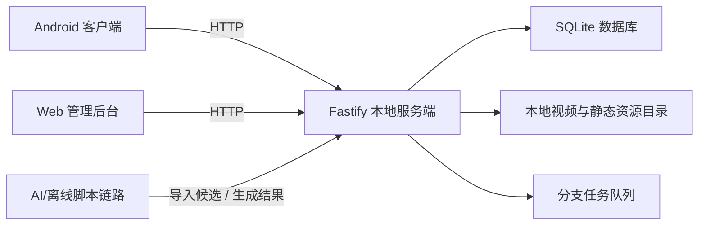
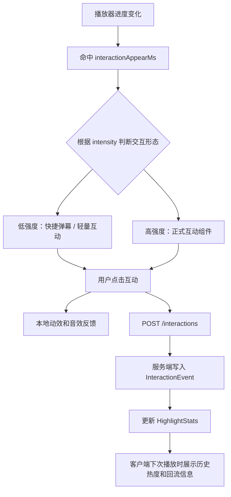
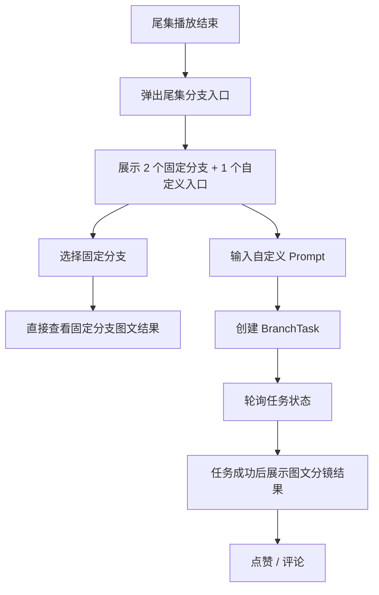
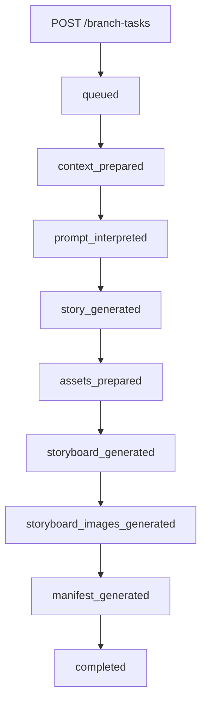

# Drama Pulse 项目交付文档（长版说明稿）

> 说明：本文档保留完整说明、展开版论证和较多技术细节；如果是飞书同步或最终提交，优先使用 [项目交付文档-飞书提交版.md](/Users/a0000/Desktop/项目文件/drama-pulse/docs/项目交付文档-飞书提交版.md)。

## 1. 项目概述

### 1.1 项目背景

短剧观看场景中存在大量高情绪密度片段，例如爽点、反转、冲突、甜蜜和名场面。用户在这些时刻往往有强烈表达欲，但传统评论和弹幕需要输入文字，表达门槛高，也容易中断观看流程。

Drama Pulse 希望解决两个问题：

- 如何在不打断观看的前提下，提供更轻量、更即时的互动表达方式
- 如何在尾集结束后继续延长用户参与感，让用户从“看完剧情”进入“继续参与剧情”

### 1.2 项目目标

本项目最终交付一个包含客户端、服务端、管理后台与 AI 处理链路的完整 MVP 闭环，围绕两条主线展开：

- `高光即时互动`：在剧情高光点按时间轴触发互动组件，完成点击反馈、互动上报与历史互动回流
- `尾集剧情分支`：在尾集结束后提供固定分支与自定义分支入口，生成和展示图文分镜化的剧情拓展结果

### 1.3 项目形态

本项目最终采用以下交付形态：

- `Android 客户端`：承载短剧播放、高光互动、尾集分支入口与结果展示
- `本地服务端`：基于 Node.js + Fastify + SQLite，提供内容、高光、互动、分支和后台接口
- `本地 Web 管理后台`：用于高光复核、任务管理、互动查看、资源配置和演示数据管理
- `AI 离线处理链路`：用于高光候选识别、剧情上下文整理、尾集分支文本与图文分镜生成

### 1.4 一句话总结

`Drama Pulse 是一个面向短剧场景的互动播放器系统：用户先在 Android 端看剧，在高光点即时互动，在尾集结束后进入固定或自定义剧情分支，从而把“看剧”延伸为“参与剧情”。`

### 1.5 项目成果摘要

为了便于评委快速理解本项目的完成度，核心成果概括如下：

| 维度 | 当前交付结果 |
| --- | --- |
| 客户端形态 | Android 原生客户端 |
| 服务形态 | 本地 Node.js + Fastify 服务端 |
| 数据存储 | SQLite + 本地静态资源目录 |
| 互动能力 | 低强度快捷弹幕、正式高光互动组件、历史回流 |
| 分支能力 | 2 个固定分支 + 1 个自定义分支任务链路 |
| 后台能力 | 高光复核、互动查看、分支任务查看与重试、资源配置 |
| AI 参与 | 高光候选识别、上下文整理、分支剧情和分镜生成 |
| 部署方式 | 个人 PC 本地部署，局域网访问 |

### 1.6 本文档定位

本文档不是前期方案讨论稿，而是面向比赛最终提交的技术交付文档，重点回答四个问题：

- 项目最终做成了什么
- 系统如何组成和如何运行
- 为什么采用当前技术路线
- 交付物和演示链路如何证明项目完整性

## 2. 需求理解与 MVP 闭环

### 2.1 对课题要求的理解

根据原始课题要求，本项目至少需要覆盖以下 MVP 闭环：

- 短剧列表与基础播放能力
- 剧情高光点打标和下发
- 客户端高光点互动
- 剧情分支或拓展能力
- 本地或公网部署能力

### 2.2 本项目选择的实现路径

在比赛给出的可选能力中，本项目同时完成了两条用户主链路：

- `高光剧情互动`
- `剧情分支或拓展`

并选择了比赛允许的本地部署方式：

- `个人 PC 本地服务部署 + 局域网访问`

### 2.3 MVP 闭环说明

当前仓库已形成以下完整闭环：

1. 用户进入 Android 客户端，浏览短剧列表并进入剧集播放
2. 客户端从服务端拉取当前剧集的 `confirmed` 高光点
3. 播放命中 `interactionAppearMs` 时，根据高光强度展示对应互动形态：
   - `低强度高光`：快捷弹幕 / 轻量互动
   - `高强度高光`：正式互动组件
4. 用户点击互动组件后，客户端产生动效反馈并上报互动事件
5. 服务端聚合互动结果，生成高光热度、热门选项与历史互动回流数据
6. 客户端在后续播放中展示历史热度和群体反馈
7. 当尾集播放结束后，客户端弹出分支入口
8. 用户可选择 `2 个固定分支` 或创建 `1 个自定义分支`
9. 自定义分支会在服务端异步生成文本剧情、图文分镜和分镜图片结果
10. 客户端展示最终图文分镜结果，并支持点赞和评论

### 2.4 当前交付范围

#### 已完成范围

- 短剧列表页
- 剧集播放页
- 选集、暂停/播放、进度条、继续观看
- 高光标签下发
- 低强度快捷弹幕与轻量高光互动
- 高强度高光互动组件触发与上报
- 历史互动热度与回流展示
- 尾集固定分支展示
- 尾集自定义分支任务创建、轮询与结果展示
- 分支结果点赞、评论
- 本地服务端与 SQLite 存储
- 本地 Web 管理后台
- 高光 AI 候选识别与人工确认链路
- 尾集分支图文分镜生成链路

#### 当前明确不纳入第一版交付的内容

- 公网部署
- 登录体系与账号系统
- 实时多人同屏互动
- 播放过程中途分叉播放
- 实时视频生成
- 端上实时视频理解

### 2.5 与评分维度的对应关系

为了让交付内容和评委评分点更直接对应，本项目的实现重点与评分维度映射如下：

| 评分维度 | 对应实现 |
| --- | --- |
| 整体功能完整性 | Android 播放、高光互动、历史回流、尾集固定分支、自定义分支、后台管理、本地部署 |
| 技术选型和实现 | Kotlin + Compose、Fastify + Prisma + SQLite、React 管理后台、结构化高光与分支任务链路 |
| 创新与自由探索 | 低强度快捷弹幕 + 高强度正式组件的交互分层、尾集图文分镜分支、AI 候选 + 人工冻结机制 |
| 文档与表达能力 | 模块拆解、流程图、排期表、AI 参与说明、附录技术文档 |

## 3. 系统整体架构

### 3.1 架构总览

### 3.2 各层职责

#### Android 客户端

- 承载短剧列表、播放页、选集、继续观看
- 承载低强度快捷弹幕、正式高光互动组件、历史热度和弹幕回流
- 承载尾集固定分支与自定义分支结果展示
- 承载分支结果点赞与评论

#### 本地服务端

- 提供内容、剧集、高光、互动、分支、进度相关接口
- 负责高光互动事件聚合
- 负责固定分支读取和自定义分支任务执行
- 负责本地静态资源 `path -> url` 映射
- 负责为管理后台提供查询与操作接口

#### SQLite 数据库

- 存储短剧、剧集、高光、高光统计、互动事件
- 存储分支选项、分支任务、点赞、评论
- 存储继续观看、收藏、播放评论、弹幕等辅助数据

#### 本地静态资源目录

- 存储视频文件
- 存储封面与高光特效资源
- 存储固定分支产物
- 存储分镜图片和其他导出结果

#### 本地 Web 管理后台

- 查看和确认高光候选
- 管理高光标签状态与时间窗口
- 查看互动统计
- 查看和重试分支任务
- 管理资源配置和演示数据

#### AI 与离线脚本链路

- 生成高光候选
- 生成剧情上下文包
- 生成尾集固定分支候选
- 生成自定义分支的剧情扩写、分镜与图文结果

### 3.3 运行与访问方式

当前项目采用本地局域网部署方式，运行关系如下：

- 服务端默认监听 `0.0.0.0:8787`
- Android 真机通过局域网 IP 访问服务端
- 管理后台在开发机本地访问同一服务端
- 视频、分镜图和静态资源都由服务端统一转换为可访问 URL

这种部署方式的好处是：

- 满足比赛对“本地服务部署”的要求
- 联调成本低
- 不需要额外准备云环境
- 演示路径稳定、便于现场排查

## 4. 模块拆解

### 4.1 模块总表

| 模块 | 目标 | 主要输入 | 主要输出 | 当前状态 |
| --- | --- | --- | --- | --- |
| 内容与资源模块 | 统一管理短剧、剧集、封面、视频和分支产物 | 原始视频、封面、固定分支素材 | 可读取的本地资源目录 | 已完成 |
| Android 客户端模块 | 承载播放、高光互动、分支体验 | 服务端 API、静态资源 URL | 用户播放行为、互动事件、分支任务请求 | 已完成 MVP |
| 服务端业务模块 | 作为前后端中枢，承接内容、高光、互动、分支和后台接口 | 客户端请求、后台请求、数据库、静态资源 | JSON API、静态资源 URL、任务执行状态 | 已完成 MVP |
| 高光识别与管理模块 | 形成“候选 -> 人工确认 -> 客户端消费”的稳定链路 | transcript、上下文包、人工复核 | confirmed 高光标签 | 已完成 MVP |
| 尾集分支生成模块 | 形成“固定分支 + 自定义分支任务”的尾集参与链路 | 尾集上下文、用户 Prompt、参考素材 | 文本剧情、图文分镜、分镜图片、manifest | 已完成 MVP |
| 数据与存储模块 | 冻结数据模型和状态口径 | 产品对象、接口对象、任务状态 | SQLite schema、Prisma 模型、统一字段定义 | 已完成 |

### 4.2 Android 客户端模块

**模块目标**

- 提供稳定的短剧播放入口
- 承载高光互动与回流展示
- 承载尾集分支入口与结果消费

**核心页面**

- `DramaListScreen`
- `PlayerScreen`
- `BranchResultScreen`

**核心能力**

- 列表、播放、选集、进度恢复
- 播放器时间轴监听
- 低强度快捷弹幕与轻量互动叠层
- 高强度高光互动叠层
- 尾集入口弹出
- 固定分支与自定义分支图文结果展示
- 分支点赞与评论

### 4.3 服务端业务模块

**模块目标**

- 作为整个系统的中枢
- 统一向 Android 和管理后台提供 API
- 统一管理异步任务、静态资源与持久化数据

**业务模块划分**

- `content`
- `highlight`
- `interaction`
- `branch`
- `progress`
- `user`
- `assets`
- `admin`

**当前核心接口**

- `GET /dramas`
- `GET /dramas/:dramaId/episodes`
- `GET /episodes/:episodeId`
- `GET /episodes/:episodeId/highlights`
- `GET /highlights/:highlightId/stats`
- `POST /interactions`
- `GET /episodes/:episodeId/branch-options`
- `POST /branch-tasks`
- `GET /branch-tasks/:taskId`
- `GET /users/:userId/branch-tasks`
- `POST /branch-tasks/:taskId/likes`
- `POST /branch-tasks/:taskId/comments`
- `GET /users/:userId/watch-progress`
- `POST /users/:userId/watch-progress`
- `GET /admin/highlights`
- `POST /admin/highlights/:highlightId/confirm`
- `GET /admin/branch-tasks`
- `POST /admin/branch-tasks/:taskId/retry`

### 4.4 高光识别与管理模块

**模块目标**

建立一条稳定、可控的高光生成链路，不让客户端依赖实时模型判断。

**核心原则**

`AI 先提候选，人工做冻结，客户端只消费 confirmed 标签`

**链路结构**

- 视频/字幕整理
- transcript 结构化
- AI 第一阶段高召回候选识别
- AI 第二阶段复核与时间修正
- 候选高光入库
- 管理后台抽检和确认
- 客户端只拉取 `confirmed`

### 4.5 尾集分支生成模块

**模块目标**

把尾集分支从简单文本结果升级为有图文分镜、可展示、可评论的完整结果系统。

**两条链路**

- `固定分支`
  - 离线预生成
  - 当前展示为图文分镜结果
- `自定义分支`
  - 用户输入 Prompt 后创建 `BranchTask`
  - 服务端异步生成图文结果

**自定义分支阶段状态**

- `queued`
- `context_prepared`
- `prompt_interpreted`
- `story_generated`
- `assets_prepared`
- `storyboard_generated`
- `storyboard_images_generating`
- `storyboard_images_generated`
- `manifest_generated`
- `completed`

### 4.6 数据与存储模块

**核心模型**

- `Drama`
- `Episode`
- `Highlight`
- `InteractionEvent`
- `HighlightStats`
- `BranchOption`
- `BranchTask`
- `BranchComment`
- `BranchLike`
- `WatchProgress`

**数据设计特点**

- 高光链路把高光本体区间和交互区间拆开
- 分支任务链路把文本、分镜、图片、manifest 分层存储
- 服务端用 `path -> url` 映射统一管理本地资源访问

## 5. 核心技术选型

### 5.1 Android 客户端

**技术栈**

- `Kotlin`
- `Jetpack Compose`
- `Media3 / ExoPlayer`
- `ViewModel + StateFlow`
- `Retrofit + OkHttp`
- `Coil`

**选择原因**

- Android 真机联调和本地视频调试成本最低
- Compose 更适合做高光叠层、分支结果卡片和状态驱动 UI
- ExoPlayer 便于监听时间轴和尾集结束事件
- StateFlow 更适合播放状态、高光状态、分支状态的统一管理

### 5.2 本地服务端

**技术栈**

- `Node.js 20`
- `TypeScript`
- `Fastify`
- `Prisma`
- `SQLite`
- `Zod`

**选择原因**

- 本项目是本地部署、I/O 密集、单人可控场景
- Fastify 足够轻，结构清晰，适合快速搭建业务 API
- SQLite 零运维，方便演示和迁移
- TypeScript 能降低前后端、后台和 AI 输出结构不一致的风险

### 5.3 本地 Web 管理后台

**技术栈**

- `React`
- `TypeScript`
- `Vite`
- `React Router`
- `TanStack Query`
- `Tailwind CSS`

**选择原因**

- 管理后台主要是查询、表单和复核流程，React + Query 的开发效率较高
- Vite 启动快，适合本地联调
- 后台需要承载高光复核和任务管理，前端不追求复杂视觉，但要求状态稳定

### 5.4 AI 与离线处理链路

**实际策略**

- 高光候选识别与复核：以 `DeepSeek` 结构化识别链路为主
- 尾集分支文本与图文内容生成：以 `Doubao` / 已接入模型链路为主

**设计原则**

- `主链路轻，AI 链路异步`
- 播放体验不依赖实时推理
- AI 输出必须进入结构化校验和人工复核环节

## 6. 高光互动闭环设计

### 6.1 高光数据结构

高光标签的核心时间字段拆分为三层：

- `startTimeMs / endTimeMs`
  - 表示高光内容本体区间
- `interactionAppearMs`
  - 表示互动组件真正出现的时间点
- `interactionStartMs / interactionEndMs`
  - 表示用户可点击和重复触发的交互窗口

这种拆分方式保证了：

- 高光内容本体可用于复核和统计
- 组件露出时机可独立调整
- 交互窗口可单独控制，不需要与高光内容完全重合

同时，高光结构中保留了 `type / intensity / templateId / interactionOptionsJson / visualEffectType` 等字段，用于决定客户端最终采用哪一种互动形态。

### 6.2 高光交互分层

为了避免所有高光都以同样重量级的组件打断视频画面，本项目将高光互动拆成两层：

- `低强度高光`
  - 采用快捷弹幕、轻量云朵弹幕或短选项态
  - 强调低遮挡、快速响应和高频表达
  - 适合轻搞笑、小幅情绪波动、弱爽点
- `高强度高光`
  - 采用正式互动组件
  - 配合更强的视觉资源、按钮样式和短时动效
  - 适合反转、强冲突、明显爽点和情绪峰值

这两种形态共享同一套高光下发、时间轴触发和互动上报链路，但在客户端表现层分层处理。

### 6.3 客户端高光触发链路

### 6.4 设计亮点

- 客户端不做高光判断，只做时间轴消费，逻辑稳定
- 低强度快捷弹幕与高强度正式组件共用一套数据链路，但视觉表达分层
- 低强度形态保证互动频率，高强度形态保证名场面的爆点表现
- 服务端聚合互动统计，客户端消费的是结构化热度结果
- 高光互动和历史回流构成闭环，不是一次性按钮

### 6.5 低强度快捷弹幕的作用

低强度快捷弹幕是本项目高光设计的重要组成部分，不是临时补充能力。

它的作用是解决两个问题：

- 不是所有剧情波动都值得弹出重组件，否则播放会被频繁打断
- 如果所有高光都是同一种交互形态，强反转和弱笑点之间就没有层级差异

因此，低强度高光被设计成：

- 更轻量
- 更高频
- 更少遮挡
- 更接近日常观众“即时吐槽”和“顺手表达”的观看习惯

它和高强度正式组件一起，组成了本项目完整的高光互动系统。

## 7. 尾集分支闭环设计

### 7.1 用户侧流程

### 7.2 固定分支

固定分支的定位是：

- 在尾集结束后立即给用户两个可选方向
- 不依赖实时生成
- 结果介质为预生成图文分镜结果

当前固定分支结果已经统一为：

- `resultHook`
- `resultStory`
- `storyboardManifestJson`
- `storyboardCards`
- 分镜图片资源

### 7.3 自定义分支任务链路

### 7.4 分支结果结构

自定义分支任务最终不只输出一段文本，而是输出一套可展示结果：

- `resultTitle`
- `resultHook`
- `resultStory`
- `storyboardJson`
- `shotPromptJson`
- `storyboardImagesJson`
- `storyboardManifestJson`
- `narrationPayloadJson`
- `referenceAssetsJson`

### 7.5 当前这条链路的工程价值

- 固定分支与自定义分支共享了结果结构和消费方式
- 任务阶段化后，后台可以知道失败卡在哪一步
- 图文结果优先于视频生成，保证了第一版可交付和可演示

## 8. 工作项拆分与排期

### 8.1 开发原则

本项目为单人完成，因此排期采用单人串行推进方式，优先保证：

- 先完成播放主链路
- 再完成高光互动闭环
- 最后完成尾集分支与 AI 增强

### 8.2 阶段排期

| 阶段 | 时间 | 主要工作项 | 主要产出 |
| --- | --- | --- | --- |
| 阶段 1 | 5/22 - 5/24 | 项目初始化、目录结构、技术方案冻结 | Android / Server / Admin 三端工程骨架 |
| 阶段 2 | 5/25 - 5/28 | 数据模型、数据库、内容接口、播放主链路 | 可播放短剧列表与剧集 |
| 阶段 3 | 5/29 - 6/01 | 高光标签结构、客户端高光触发、互动上报 | 高光互动 MVP |
| 阶段 4 | 6/02 - 6/04 | 高光复核后台、热度聚合、历史回流 | 高光闭环稳定版 |
| 阶段 5 | 6/05 - 6/08 | 固定分支、自定义分支任务、图文结果页 | 尾集分支闭环 |
| 阶段 6 | 6/09 - 6/10 | 联调、测试、提示词收口、交付文档与录屏准备 | 最终交付版 |

### 8.3 单人分工说明

由于本项目为单人完成，因此不存在多人拆分角色，所有模块均由同一开发者负责，包括：

- 产品方案收口
- Android 客户端开发
- 服务端开发
- 后台开发
- AI 提示词与生成链路调优
- 测试、联调与交付文档整理

### 8.4 关键里程碑

从交付视角看，本项目有 4 个关键里程碑：

1. `播放主链路跑通`
   - 列表、剧集、选集、继续观看和播放器状态机稳定
2. `高光互动闭环跑通`
   - 高光下发、快捷弹幕/正式组件触发、互动上报、热度回流稳定
3. `尾集分支闭环跑通`
   - 固定分支可展示，自定义分支可创建、轮询并展示图文结果
4. `本地部署与演示材料收口`
   - 服务端、后台、客户端可联调，文档、截图和录屏可直接提交

## 9. AI 参与说明

### 9.1 AI 使用原则

本项目明确鼓励使用 AI，但不把 AI 作为不可控黑盒直接暴露到用户播放主链路中，而是通过结构化结果、人工确认和异步任务来约束风险。

### 9.2 AI 参与表

| 环节 | AI 参与方式 | 主要模型/能力 | 人工参与方式 |
| --- | --- | --- | --- |
| 高光候选识别 | 从 transcript 中识别候选高光 | DeepSeek 结构化识别链路 | 后台人工确认与时间修正 |
| 高光复核 | 第二阶段复核候选时间窗口和文案 | DeepSeek 二阶段提示词 | 人工抽检和冻结 |
| 剧情上下文整理 | 生成尾集分支所需上下文包 | LLM 上下文整理 | 人工审阅关键字段 |
| 固定分支候选生成 | 生成多条固定分支候选方向 | LLM 生成 | 人工筛选和统一风格 |
| 自定义分支剧情扩写 | 把用户 Prompt 扩展为结构化故事 | LLM 生成 | 人工调提示词与约束 |
| 分镜与提示词生成 | 生成分镜卡文案、图像提示词和参考约束 | LLM 生成 | 人工调优提示词口径 |
| 技术文档与测试辅助 | 辅助文档收口、测试补齐、链路检查 | AI 编写与审阅辅助 | 人工最终确认 |

### 9.3 为什么这种使用方式更适合比赛项目

- 保证演示稳定性
- 保证结果可复查、可回滚
- 避免将实时模型输出直接挂到播放器关键路径
- 让 AI 更多承担“生成候选”和“加速开发”角色，而不是取代业务控制

## 10. 测试与稳定性说明

### 10.1 服务端测试

服务端已形成以 `Vitest` 为核心的测试体系，当前仓库中已覆盖以下方向：

- `content` 接口测试
- `highlight` 接口测试
- `interaction` 接口测试
- `branch` 接口测试
- `admin` 接口测试
- `taskQueue`、`storyboard`、`imageClient` 等模块测试

### 10.2 Android 端测试

Android 端当前已覆盖以下类型的单元测试：

- `ViewModel` 状态流测试
- `Mapper` 与数据转换测试
- `Repository` 行为测试
- `Player` 相关交互测试
- `Branch` 相关结果流转测试

### 10.3 稳定性设计

为保证本地演示稳定性，项目在设计上采用了以下策略：

- 客户端不依赖实时 AI 判断
- 服务端统一做资源路径映射，避免客户端直接拼接本地路径
- 分支任务异步执行，避免阻塞主线程接口
- 高光只消费 `confirmed` 状态标签，避免候选误判进入播放主链路
- 固定分支离线预生成，保证尾集演示路径稳定

### 10.4 当前验证结果摘要

目前项目的关键链路已经完成过针对性的功能验证与测试校验，重点包括：

- 服务端 `content / highlight / interaction / branch / admin` 相关测试通过
- 分支链路已验证固定分支 sidecar 与服务端校验规则一致
- Android 端已有 `ViewModel / Mapper / Repository / Player / Branch` 方向单元测试
- 固定分支与自定义分支结果已统一到 `storyboardCards` 图文消费结构

对最终提交来说，这意味着项目不仅有功能展示，也具备基本的工程稳定性证明。

## 11. 项目亮点与创新点

### 11.1 即时互动不是评论替代，而是观看内的轻表达机制

本项目没有把互动设计成“播放完成后再评论”，而是把表达动作嵌入剧情高光瞬间，使互动成为观看体验的一部分。

并且这套互动能力本身是分层的：

- 低强度高光采用快捷弹幕和轻量表达
- 高强度高光采用正式组件和更强反馈

这让项目里的互动能力不是“只有一种按钮”，而是一套随剧情强弱变化的表达系统。

### 11.2 高光互动与历史回流形成了完整闭环

用户当前点击不仅触发即时反馈，还会沉淀为后续观看中的热度和回流信息，形成群体共看感。

### 11.3 尾集分支从文本结果升级为图文分镜结果

相比仅返回一段续写文本，本项目把尾集分支结果升级为：

- 文本剧情
- 分镜结构
- 分镜图
- 图文 manifest

这样更适合展示，也更有“继续参与剧情”的产品感。

### 11.4 AI 采用可控的结构化接入方式

本项目没有把 AI 直接挂到最敏感的播放主链路，而是通过：

- 高光候选 + 人工冻结
- 分支异步生成 + 结构化校验

把 AI 约束在可验证、可调优、可答辩的范围内。

## 12. 已知边界与后续可扩展方向

### 12.1 当前边界

- 分支结果第一版以图文分镜为主，不做视频生成闭环
- 播放过程只做高光互动，不做中途剧情分支跳转
- 当前部署是本地局域网模式，不包含公网服务

### 12.2 后续可扩展方向

- 接入公网部署与云端对象存储
- 增加分支结果 TTS 配音与视频合成
- 增加更多短剧和更多高光类型
- 做更细粒度的高光热度推荐和用户画像分析
- 支持中途关键剧情节点分支

## 13. 交付物清单

### 13.1 代码仓库

- GitHub 仓库：[LiuAHao/drama-pulse](https://github.com/LiuAHao/drama-pulse)

### 13.2 客户端产物

- Android 客户端工程
- 可安装 APK：[drama-pulse-debug.apk](/Users/a0000/Desktop/项目文件/drama-pulse/docs/submission-assets/apk/drama-pulse-debug.apk)
- APK 归档目录：`docs/submission-assets/apk/`
- APK SHA256：`edc3cac413d4bdc96430e66d14ff21db03a38251f164f202746c022cea9f6f66`

### 13.3 服务端与后台产物

- 本地服务端工程
- 本地 Web 管理后台工程
- SQLite 数据库与 seed 数据

### 13.4 演示材料

- 项目展示录屏：请补充到 `docs/submission-assets/videos/`
- 关键页面截图：已补充至 `docs/submission-assets/screenshots`

### 13.5 文档材料

- 本交付主文档
- 技术方案与模块说明附录
- 本地启动说明

### 13.6 建议插入的截图与页面证据

为提升最终飞书文档的说服力，建议在正文中按以下位置补图：

| 建议位置 | 推荐截图内容 | 作用 |
| --- | --- | --- |
| 第 1 章后 | 项目总览图或首页截图 | 让评委快速建立项目印象 |
| 第 2 章 MVP 闭环后 | Android 播放页 + 高光触发瞬间 | 证明主链路真实可见 |
| 第 6 章高光互动闭环 | 低强度快捷弹幕、高强度正式组件各 1 张 | 证明交互分层设计 |
| 第 7 章尾集分支闭环 | 固定分支入口页、自定义分支结果页 | 证明分支链路跑通 |
| 第 10 章测试说明后 | 后台页面或测试运行截图 | 证明工程完整性 |
| 第 13 章交付物清单后 | 录屏封面或最终成果总览图 | 收束交付感 |

## 14. 附录文档链接

以下文档建议作为飞书交付文档中的附录引用：

- [技术选型与落地说明](/Users/a0000/Desktop/项目文件/drama-pulse/docs/技术选型与落地说明.md)
- [模块拆解初稿](/Users/a0000/Desktop/项目文件/drama-pulse/docs/模块拆解初稿.md)
- [开发顺序与任务拆解初稿](/Users/a0000/Desktop/项目文件/drama-pulse/docs/开发顺序与任务拆解初稿.md)
- [Android 端技术实现方案](/Users/a0000/Desktop/项目文件/drama-pulse/docs/Android端技术实现方案.md)
- [本地服务端技术实现方案](/Users/a0000/Desktop/项目文件/drama-pulse/docs/本地服务端技术实现方案.md)
- [高光识别与打标实现方案](/Users/a0000/Desktop/项目文件/drama-pulse/docs/高光识别与打标实现方案.md)
- [尾集分支生成任务技术实施方案](/Users/a0000/Desktop/项目文件/drama-pulse/docs/尾集分支生成任务技术实施方案.md)
- [本地启动与后台登录说明](/Users/a0000/Desktop/项目文件/drama-pulse/docs/本地启动与后台登录说明.md)

---

## 15. 最终提交前检查清单

在提交 GitHub、录屏和飞书文档之前，建议按以下清单逐项确认：

- 已补全 GitHub 仓库地址
- 已补全 APK 或安装包获取方式
- 已补全 Demo 录屏链接
- 已补全关键页面截图
- 已确认服务端端口、局域网 IP 和本地启动说明与当前环境一致
- 已手动走通一次完整演示链路：
  - 短剧列表进入播放
  - 高光触发低强度快捷弹幕
  - 高光触发高强度正式组件
  - 历史互动可回流
  - 尾集结束后分支入口弹出
  - 固定分支可展示
  - 自定义分支可生成并展示
  - 点赞评论可用
- 已将本主文档同步到飞书并调整标题、加粗、流程图和截图版式

### 15.1 建议最终文档标题

飞书最终提交时，建议直接使用下面这个标题：

`Drama Pulse：基于短剧剧情高光的即时互动播放器项目交付文档`

### 15.2 建议答辩开场顺序

如果后续需要线上答辩，建议按下面顺序讲：

1. 先讲问题：为什么短剧用户需要更轻量的互动表达
2. 再讲两条主链路：高光互动闭环、尾集分支闭环
3. 再讲系统架构：Android + Server + Admin + AI
4. 最后讲亮点：交互分层、图文分镜分支、AI 可控接入

这样最容易让评委先建立业务价值，再理解技术复杂度。
